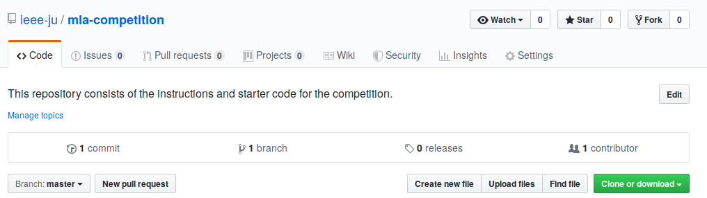
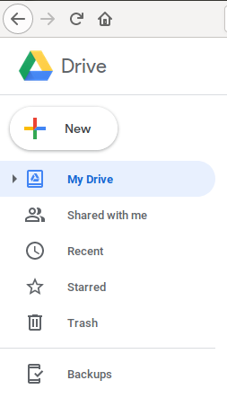
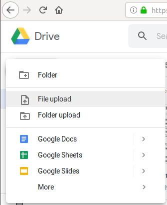
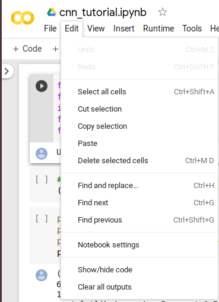
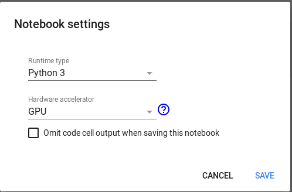

# How to proceed with the competition and workshop

* Download this repository by clicking the green icon as shown in the figure.

A zipped file will be downloaded soon.

* Navigate to this downloaded zipped file and extract it anywhere.

* After extraction, you will see the  and  file. Note the location of these two notebooks.

* Now, open a browser and navigate to 

* Click on New -> File upload

     

* A screen will pop up asking for the which file to upload. Recollect the location of individual files and upload them ** one by one ** .

* Right click on the file name, dependng upon the file you need. A drop-down menu will appear and select the ** open with ** option. Another drop-down menu will appear. Select Google Colaboratory.  

* If the Colaboratory (or Colab) option does not exist, use the Connect more apps option to add Colab.

* After opening the desired file in Colab click on Edit -> Notebook settings.

* A box will appear to choose your python version and hardware acceleration settings. Choose Python 3 and GPU respectively.

## You are good to go now! :boom:

Use Shift + Enter keys to execute the individual cells.